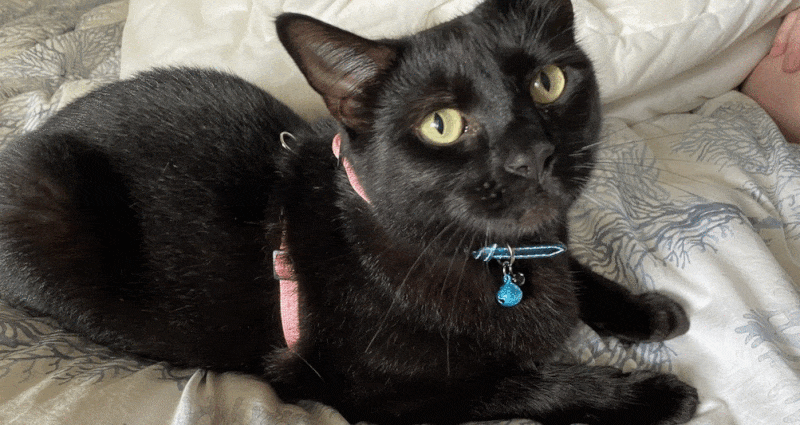

# 1 Cat, 3 Clouds — Where is Snowy sleeping?

Our cat Snowy is an outdoor cat — but we are beginning to wonder where she travels once she’s left the house. Let me share how I built a low cost pet tracking device to show Snowy’s location in real-time.

Plus, what’s it like to build the same IoT data project in AWS, Azure & Google Cloud in 2021? 

## Blog
https://simonaubury.com/202101_1cat3cloudspart1/post/

# AWS
* [AWS Notebook; Mapping with plotly express](cloud_aws/MapWithLines.ipynb)

# Azure
* [Azure Funtion Apps](cloud_azure/FunctionApp) 
* [Azure Notebook; Mapping with CosmosDB](cloud_azure/Notebooks/CosmosDBMapNotebook.ipynb)

# Google Cloud
* [Google BigQuery and Cloud Functions](cloud_google/google_cloud.md)